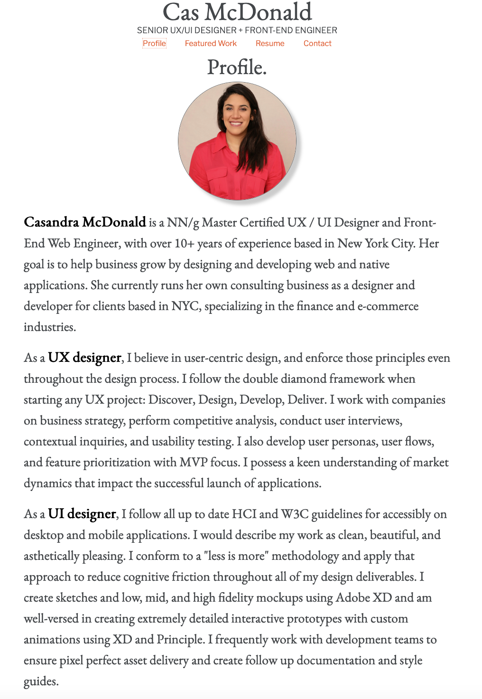

# Table of Contents:
* [Project Description](#Project)
* [Deployed Links](#Links)
* [Usage](#Usage)
* [Credits](#Credits)
* [License](#License)

# Project:
## Title:
# c02-Cas-Developer-Website

## Description:
As for our second week of homework for this assignment we (Columbia Engineering Bootcamp students) were given the following user story below and acceptance criteria:

## User Story

```
AS AN employer
I WANT to view a potential employee's deployed portfolio of work samples
SO THAT I can review samples of their work and assess whether they're a good candidate for an open position
```

### Acceptance Criteria

```
GIVEN I need to sample a potential employee's previous work
WHEN I load their portfolio
THEN I am presented with the developer's name, a recent photo, and links to sections about them, their work, and how to contact them
WHEN I click one of the links in the navigation
THEN the UI scrolls to the corresponding section
WHEN I click on the link to the section about their work
THEN the UI scrolls to a section with titled images of the developer's applications
WHEN I am presented with the developer's first application
THEN that application's image should be larger in size than the others
WHEN I click on the images of the applications
THEN I am taken to that deployed application
WHEN I resize the page or view the site on various screens and devices
THEN I am presented with a responsive layout that adapts to my viewport
```

The key focus on the project was taking all the material we have learned over the past three weeks and creating a beautiful portfolio site of our choosing. This process involved writing html and css from scratch. I (Casandra McDonald) first started by creating a git repo and setting up my local folder structure. I drew a wireframe and then wrote all of the HTML. Then I started styling with CSS. After, I moved into Flexbox and additional styling features. I added a few fun things that were not taught in class such as horizontal rules, adding a fav icon, and the font awesome library. Additionally I used subtle transform hover properties. I used materialize.css to create a form and finally media queries to capture smaller screens. Lastly I structured and cleaned up all my thml and css. The end result was a clean, beautiful portfolio site. Even though It took a while because of my perfectionism, I am very happy with my work.

Thanks for reading!

#Links
## Deployed Link:
https://defy1x.github.io/c02-Cas-Developer-Website/

#Usage
## Final screenshot


This was my final version of my portfolio website. I am very proud of this.

#Credits
Thank you to everyone who participated on the group zoom call on Wednesday 2/10/2021 within Columbia Bootcamp.

#License
MIT License

Copyright (c) 2021 Casandra McDonald

Permission is hereby granted, free of charge, to any person obtaining a copy
of this software and associated documentation files (the "Software"), to deal
in the Software without restriction, including without limitation the rights
to use, copy, modify, merge, publish, distribute, sublicense, and/or sell
copies of the Software, and to permit persons to whom the Software is
furnished to do so, subject to the following conditions:

The above copyright notice and this permission notice shall be included in all
copies or substantial portions of the Software.

THE SOFTWARE IS PROVIDED "AS IS", WITHOUT WARRANTY OF ANY KIND, EXPRESS OR
IMPLIED, INCLUDING BUT NOT LIMITED TO THE WARRANTIES OF MERCHANTABILITY,
FITNESS FOR A PARTICULAR PURPOSE AND NONINFRINGEMENT. IN NO EVENT SHALL THE
AUTHORS OR COPYRIGHT HOLDERS BE LIABLE FOR ANY CLAIM, DAMAGES OR OTHER
LIABILITY, WHETHER IN AN ACTION OF CONTRACT, TORT OR OTHERWISE, ARISING FROM,
OUT OF OR IN CONNECTION WITH THE SOFTWARE OR THE USE OR OTHER DEALINGS IN THE
SOFTWARE.
